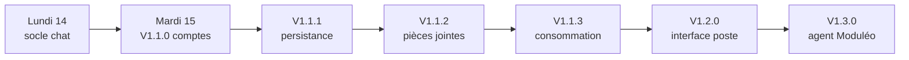
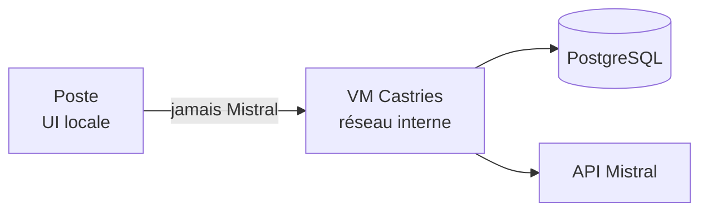

# BBASS-Agents-IA

Logiciel d'agents IA pour le cabinet de géomètres-experts BBASS. L'objectif est de mettre à disposition des collaborateurs une interface unique donnant accès à plusieurs agents métiers, capables de les assister sur des tâches courantes du cabinet. Le moteur de langage retenu est Mistral AI, choix du cabinet pour des raisons de souveraineté et de sécurité : ce projet ne consiste pas à entraîner une IA, mais à construire les agents et l'application qui les exploite.

## État actuel

Socle V1 en cours (branche `feat/v1-socle`) : backend local **poste** (interface HTML/CSS/JS) et API **VM centrale** (comptes PostgreSQL + relais Mistral). Les agents métiers ne sont pas encore construits.

## Ce qu'on construit

Une application composée d'un backend Python et d'une interface web (HTML/CSS/JS), avec des comptes par collaborateur. L'interface prend la forme d'une fenêtre de discussion (type chatbot) servant de point d'entrée vers les différents agents métiers. Le logiciel est destiné à être déployé et mis à jour de façon centralisée, pour être utilisé directement sur les postes des agences.

## Agents prévus

- Administration
- Appels d'offres
- Foncier
- DAO
- Urbanisme
- Détection de réseaux

## Semaine du 14 au 18 septembre 2026

Point visé vendredi 18 septembre : **V1.3.0**.

### Travail réalisé

- **Lundi 14** — environnement (éditeur, Git), dépôt GitHub, glossaire, spécifications, ADR ; première interface de chat ; API Mistral via la VM avec des comptes de test.
- **Mardi 15** — socle chat (Pay as you go Mistral) ; **V1.1.0** (comptes administrateurs, collaborateurs, pôles, mots de passe, révocation de session) et tests utilisateurs ; échange Topo sans suite immédiate.

### Reste à implémenter

- **V1.1.1** — persistance des conversations côté cabinet (PostgreSQL sur la VM) : plusieurs fils, multi-tours, résumé glissant, profil de travail ; pas de stockage Mistral Conversations.
- **V1.1.2** — pièces jointes : upload et envoi à Mistral (table déjà prévue en 1.1.1, encore vide).
- **V1.1.3** — suivi de la consommation : tokens (entrée / sortie / total) par compte et par session, dates, modèle, coût ; API tarifs Mistral si elle existe.
- **V1.2.0** — interface poste (modales, écran comptes, minimum de style ; framework ou HTML/CSS/JS à choisir).
- **V1.3.0** — premier agent, pôle Administration, Moduléo (API, serveur de test, lecture seule, plan d’automatisme sans écriture ni exécution).

### Attendu pour la fin de semaine (V1.3.0)

- **Architecture** — logiciel sur le poste (interface web locale) ; VM à Castries, réseau interne seulement. La VM détient les comptes, les conversations et la clé API Mistral. PostgreSQL sur la VM (plus SQLite) ; Postgres local via Docker en développement.
- **Connexion et chat** — identifiant / mot de passe ; session conservée (compte Windows) jusqu’à déconnexion ou révocation. Chat vers Mistral ; affichage prénom, nom, identifiant, agence et pôle(s). Plusieurs conversations par compte, persistées sur la VM (reprise après rechargement, relance, autre machine). Titre auto, renommage, suppression. Historique borné (3 derniers messages + résumé). Profil de travail consultable, sans modifier l’identité du compte. Conversations privées (y compris vis-à-vis d’un administrateur). Pièces jointes stockées sur la VM et transmises à Mistral. Suivi de consommation (tokens, dates, modèle, coût). UX poste minimale (modales, écran comptes).
- **Comptes administrateurs** — droit global, distinct du pôle Administration. Premier administrateur créé en base à la main ; ensuite liste / création / modification depuis le poste (identité, email, agence, un ou plusieurs des six pôles). Mot de passe aléatoire à la création ou réinitialisation, à changer avant le chat. Déconnexion forcée. Promotion, rétrogradation et suppression : clé d’administration VM en plus ; impossible de supprimer ou rétrograder le dernier administrateur.
- **Premier agent** — pôle Administration, Moduléo, serveur de test : version minimale pour montrer que ça marche.

## Prérequis

- **Python 3.11** (série figée : pas 3.12 / 3.13 / 3.14).
  - Windows : dernier installeur officiel [Python 3.11.9](https://www.python.org/downloads/release/python-3119/) — prendre *Windows installer (64-bit)*. Cocher **Add python.exe to PATH**. Les correctifs 3.11.x plus récents n'ont plus d'installeur (source only).
  - macOS : `brew install python@3.11` (Homebrew), ou l'installeur officiel [Python 3.11.9](https://www.python.org/downloads/release/python-3119/) (*macOS 64-bit universal2 installer*).
- **Docker Desktop** pour le PostgreSQL local de la VM centrale ([ADR-0008](docs/adr/0008-postgresql-vm-centrale.md)) — pas nécessaire pour lancer les tests pytest (SQLite en mémoire).
- Une clé API Mistral (console [La Plateforme](https://console.mistral.ai)) pour un vrai chat ; les tests pytest n'en ont pas besoin
- Chemins avec espaces (dossier `Dossiers individuels…`) : rester dans le dossier, ou tout quotter.

## Démarrer

Après avoir installé les prérequis ci-dessus (Python 3.11, Docker Desktop lancé), le parcours officiel est : cloner le dépôt, puis double-cliquer sur l'un des deux scripts à la racine correspondant à ton OS — aucune autre commande à taper.

**Windows** (`.bat`) :

- `lancer-vm.bat` : démarre PostgreSQL puis la VM centrale seule (2 fenêtres : logs Postgres, VM centrale) — utile pour développer/tester la VM seule.
- `lancer-logiciel.bat` : démarre PostgreSQL, la VM centrale et le poste (2 fenêtres : VM centrale, poste), puis ouvre le navigateur sur l'interface.

**macOS** (`.command`, équivalents des `.bat` ci-dessus) :

- `lancer-vm.command` : démarre PostgreSQL puis la VM centrale seule (2 fenêtres Terminal : logs Postgres, VM centrale).
- `lancer-logiciel.command` : démarre PostgreSQL, la VM centrale et le poste (2 fenêtres Terminal : VM centrale, poste), puis ouvre le navigateur sur l'interface.

  Premier lancement : si un clic droit → *Ouvrir* est nécessaire (Gatekeeper, seulement si le dépôt a été téléchargé en `.zip` plutôt que cloné avec `git clone`), ou si le double-clic ne fait rien, exécute une fois dans un Terminal (à la racine du dépôt) `chmod +x lancer-vm.command lancer-logiciel.command` puis retente le double-clic.

Les deux jeux de scripts sont autonomes : au besoin, ils créent les environnements virtuels (`vm-centrale/.venv`, et `poste/.venv` pour `lancer-logiciel.*`), installent les dépendances (`pip install -e .`) et créent les fichiers `.env` manquants à partir des `.env.example` correspondants (racine, `vm-centrale/`, `poste/`). Rien de manuel à faire au premier clone, ni après un `git pull` qui modifie un `pyproject.toml`. La logique commune aux deux scripts d'une même plateforme vit dans `scripts/` (`*.bat` pour Windows, `*.sh` pour macOS) afin d'éviter deux copies divergentes.

Pour un vrai chat (pas seulement le compte de test), colle ta clé API Mistral dans `MISTRAL_API_KEY` du fichier `vm-centrale/.env` — jamais dans Git.

Fermer les fenêtres arrête les processus correspondants (PostgreSQL continue de tourner en arrière-plan tant que `docker compose down` n'a pas été lancé). Les `.env` (racine, `vm-centrale/`, `poste/`) portent des identifiants/secrets locaux — ne jamais les commiter (déjà dans `.gitignore`).
