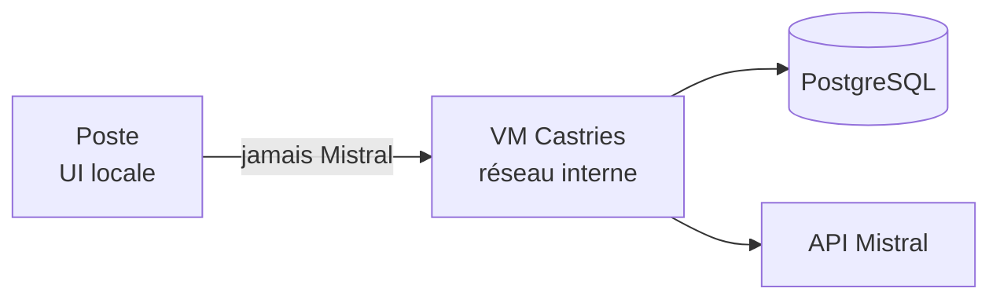
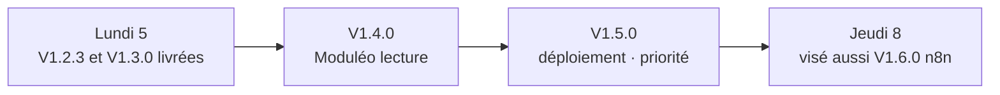

# BBASS-Agents-IA

Logiciel d'agents IA pour le cabinet de géomètres-experts BBASS. L'objectif est de mettre à disposition des collaborateurs une interface unique donnant accès à plusieurs agents métiers, capables de les assister sur des tâches courantes du cabinet. Le moteur de langage retenu est Mistral AI, choix du cabinet pour des raisons de souveraineté et de sécurité : ce projet ne consiste pas à entraîner une IA, mais à construire les agents et l'application qui les exploite.

## État actuel

**V1.3.0** disponible : Mode développeur (outil de débogage, pas un écran métier) — `Ctrl+Maj+D` depuis n'importe quel compte ouvre un nouvel onglet `/inspecteur`, débloqué par la Clé d'administration VM, qui montre pour toute conversation de tout compte ([ADR-0012](docs/adr/0012-mode-developpeur-cle-admin-vm-tous-comptes.md)) chaque appel Mistral réel dans l'ordre (chat, titrage, résumé+profil, OCR, vision, tool calling) avec le payload exact envoyé et la réponse brute reçue, échecs compris. Hérite de la V1.2.3 : délais de chargement réduits sur les navigations et l'ouverture/bascule de conversation — cache TanStack Query revu par requête (conversation, Profil, Panel d'administration) avec `placeholderData` sur le détail de conversation pour supprimer le flash d'état vide, pagination par curseur du détail d'une conversation (fenêtre récente par défaut, historique plus ancien chargé au défilement façon ChatGPT), instrumentation de temps légère (`performance.mark`/`performance.measure`, désactivée par défaut) réutilisée par la 1.3.0. Hérite aussi du style de réponse de l'IA (1.2.2 — vouvoiement, Markdown borné) et de l'identité visuelle du poste aux couleurs du cabinet BBASS (palette anthracite/rouge, police Manrope auto-hébergée, logo, favicon) et de la disposition façon ChatGPT (sidebar avec conversations et puce compte, page Profil dédiée, Panel d'administration dédié avec tableaux/étiquettes shadcn/ui). Backend local **poste** (interface React/TypeScript/Vite, shadcn/ui) et API **VM centrale** (comptes administrateurs PostgreSQL, relais Mistral, conversations persistées avec historique borné, résumé glissant et profil de travail, pièces jointes PDF/Word/Excel/image avec extraction et rappel via outil hors fenêtre, suivi de la consommation Mistral — tokens/pages et coût figé au tarif du jour, par conversation côté collaborateur et agrégé par compte côté administrateur). Les agents métiers ne sont pas encore construits.

## Ce qu'on construit

Une application composée d'un backend Python et d'une interface web (HTML/CSS/JS), avec des comptes par collaborateur. L'interface prend la forme d'une fenêtre de discussion (type chatbot) servant de point d'entrée vers les différents agents métiers. Le logiciel est destiné à être déployé et mis à jour de façon centralisée, pour être utilisé directement sur les postes des agences.

## Agents prévus

- Administration
- Appels d'offres
- Foncier
- DAO
- Urbanisme
- Détection de réseaux

## Architecture

Le poste n’appelle jamais Mistral directement : tout passe par la VM centrale (réseau interne), qui détient aussi PostgreSQL et la clé API.

## Semaine du 05 au 09 octobre 2026

Point visé jeudi 8 octobre : enchaînement jusqu’à **V1.6.0** (n8n) — **priorité V1.5.0** (déploiement postes / CI/CD), puis **V1.6.0** si le temps le permet. Vendredi 9 : RTT.

### Travail réalisé

- **Semaine du 14–18 septembre** — socle jusqu’à **V1.2.0** (comptes admin, persistance conversations, pièces jointes, consommation, front React/TypeScript/Vite).
- **Depuis** — **V1.2.1** (identité visuelle BBASS, disposition type ChatGPT) ; **V1.2.2** (prompt système de style sur le chat principal ; rendu Markdown borné côté poste).
- **Lundi 5 octobre** — **V1.2.3** (cache TanStack Query, pagination par curseur du détail de conversation, instrumentation de temps légère) ; **V1.3.0** (Mode développeur : inspecteur des échanges avec le modèle).

### Reste à implémenter

- **V1.4.0** — Moduléo en lecture (outil transverse), premier branchement via l’Agent Administration.
- **V1.5.0** — déploiement postes : CI/CD, conteneurisation, installateur / logiciel d’accès au chat (backend local obligatoire) — **priorité**.
- **V1.6.0** — workflows n8n, branchés sur Moduléo 1.4.0 — **proposé cette semaine** après la 1.5.0.

### Attendu pour la fin de semaine (V1.5.0 prioritaire, V1.6.0 visé)

- **Déjà en place** — poste + VM Castries, PostgreSQL, chat Mistral, conversations bornées + résumé + profil, pièces jointes, consommation, comptes administrateurs, UI React BBASS, style 1.2.2, fluidité 1.2.3, inspecteur des échanges 1.3.0.
- **V1.4.0** — Q&A lecture Moduléo depuis le chat (pour usage collab pendant l’absence alternance).
- **V1.5.0** — pouvoir **installer / mettre à jour** le logiciel sur les postes (CI/CD, Docker si retenu, installateur ; UI pywebview et/ou navigateur — à trancher).
- **V1.6.0** — socle n8n branché sur Moduléo 1.4.0 (on tente de le livrer jeudi ; non bloquant si seule la 1.5.0 passe).

## Prérequis

- **Python 3.11** (série figée : pas 3.12 / 3.13 / 3.14).
  - Windows : dernier installeur officiel [Python 3.11.9](https://www.python.org/downloads/release/python-3119/) — prendre *Windows installer (64-bit)*. Cocher **Add python.exe to PATH**. Les correctifs 3.11.x plus récents n'ont plus d'installeur (source only).
  - macOS : `brew install python@3.11` (Homebrew), ou l'installeur officiel [Python 3.11.9](https://www.python.org/downloads/release/python-3119/) (*macOS 64-bit universal2 installer*).
- **Docker Desktop** pour le PostgreSQL local de la VM centrale ([ADR-0008](docs/adr/0008-postgresql-vm-centrale.md)). Les lanceurs le démarrent tout seuls s’il est installé mais pas lancé (attendre une à deux minutes le premier gel du moteur). Ils ne l’installent pas : Docker Desktop reste à installer une fois à la main.
- Une clé API Mistral (console [La Plateforme](https://console.mistral.ai)) pour un vrai chat

## Démarrer

Après avoir installé les prérequis ci-dessus (Python 3.11, Docker Desktop installé ; Docker Desktop est lancé par le lanceur s’il est arrêté), le parcours officiel est : cloner le dépôt, puis double-cliquer sur l'un des deux scripts à la racine correspondant à ton OS — aucune autre commande à taper.

**Windows** (`.bat`) :

- `lancer-vm.bat` : démarre PostgreSQL puis la VM centrale seule (2 fenêtres : logs Postgres, VM centrale) — utile pour développer/tester la VM seule.
- `lancer-logiciel.bat` : démarre PostgreSQL, la VM centrale et le poste (2 fenêtres : VM centrale, poste), puis ouvre le navigateur sur l'interface.

**macOS** (`.command`, équivalents des `.bat` ci-dessus) :

- `lancer-vm.command` : démarre PostgreSQL puis la VM centrale seule (2 fenêtres Terminal : logs Postgres, VM centrale).
- `lancer-logiciel.command` : démarre PostgreSQL, la VM centrale et le poste (2 fenêtres Terminal : VM centrale, poste), puis ouvre le navigateur sur l'interface.

  Premier lancement : si un clic droit → *Ouvrir* est nécessaire (Gatekeeper, seulement si le dépôt a été téléchargé en `.zip` plutôt que cloné avec `git clone`), ou si le double-clic ne fait rien, exécute une fois dans un Terminal (à la racine du dépôt) `chmod +x lancer-vm.command lancer-logiciel.command` puis retente le double-clic.

Les deux jeux de scripts sont autonomes : au besoin, ils installent [uv](https://docs.astral.sh/uv/) s’il manque ([ADR-0011](docs/adr/0011-gestion-dependances-python-avec-uv.md)), créent les environnements virtuels (`vm-centrale/.venv`, et `poste/.venv` pour `lancer-logiciel.*`), installent les dépendances (`uv sync`, versions figées par `uv.lock`) et créent les fichiers `.env` manquants à partir des `.env.example` correspondants (racine, `vm-centrale/`, `poste/`). Rien de manuel à faire au premier clone, ni après un `git pull` qui modifie un `pyproject.toml`/`uv.lock`. La logique commune aux deux scripts d'une même plateforme vit dans `scripts/` (`*.bat` pour Windows, `*.sh` pour macOS) afin d'éviter deux copies divergentes.

Pour un vrai chat (pas seulement le compte de test), colle ta clé API Mistral dans `MISTRAL_API_KEY` du fichier `vm-centrale/.env` — jamais dans Git.

Fermer les fenêtres arrête les processus correspondants (PostgreSQL continue de tourner en arrière-plan tant que `docker compose down` n'a pas été lancé). Les `.env` (racine, `vm-centrale/`, `poste/`) portent des identifiants/secrets locaux — ne jamais les commiter (déjà dans `.gitignore`).
