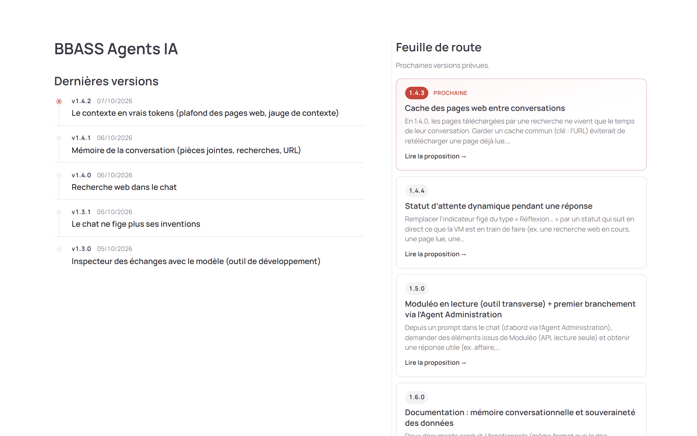
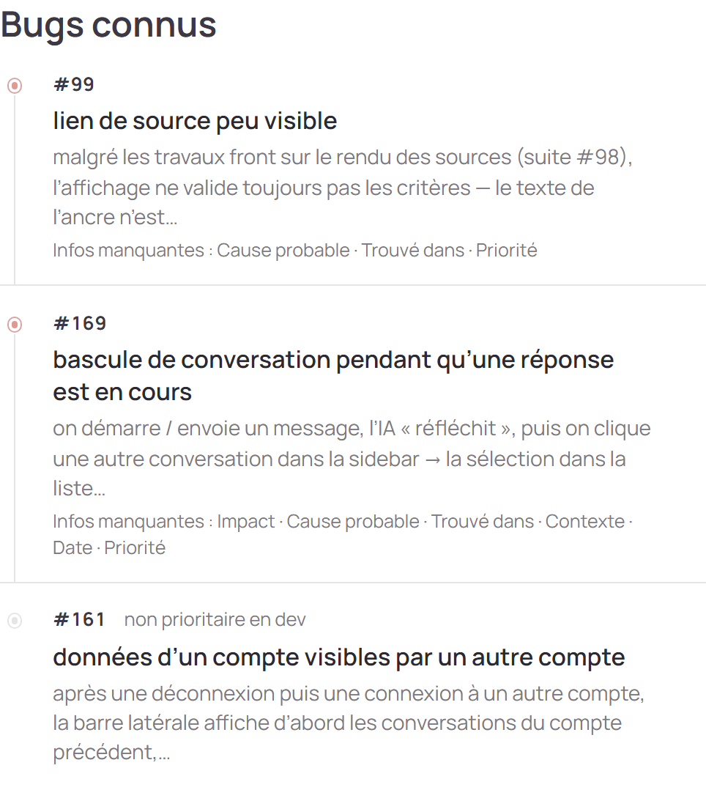
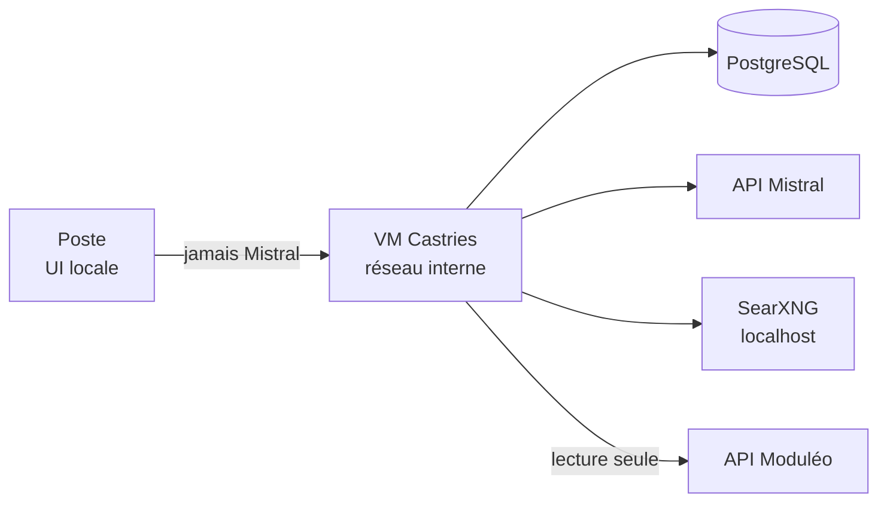
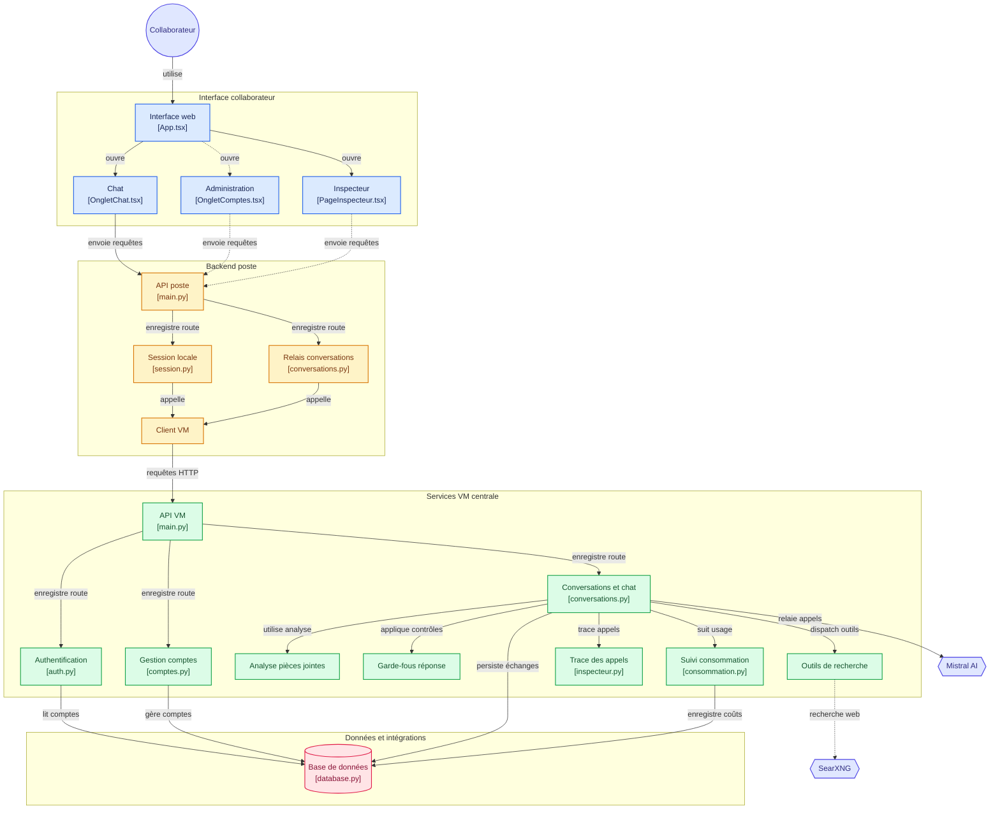
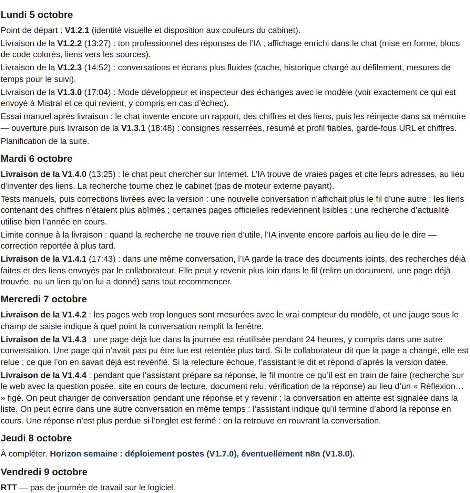

  

<!-- sync:stats-commits -->

  
  

<!-- /sync:stats-commits -->

# Un copilote multi-agents pour le cabinet

**BBASS Agents IA** est un espace de discussion type ChatGPT, branché sur plusieurs agents métiers : ils répondent aux questions du quotidien et peuvent aussi enchaîner des actions (outils, recherches, workflows) à la place du collaborateur. Le moteur de langage est Mistral AI — choix du cabinet pour la souveraineté et la sécurité : on ne forme pas un modèle, on construit les agents et l’application qui les exploitent.

## Documentation fonctionnelle et technique

  

## État actuel

## Bugs

  

## Agents prévus

- Administration
- Appels d'offres
- Foncier
- DAO
- Urbanisme
- Détection de réseaux

## Architecture

<!-- sync:vue-systeme-mermaid -->

<!-- /sync:vue-systeme-mermaid -->

## Semaine du 05 au 09 octobre 2026

**V1.5.0** livrée le 08/10 (Moduléo en lecture seule depuis le chat), puis **V1.5.1** (lecture de plus de données Moduléo) et **V1.5.2** (écriture Moduléo, dès que Kipaware aura confirmé un serveur de test). **V1.4.0** livrée le 06/10 (recherche web ; bug connu [#131](https://github.com/UlyssouLV/BBASS-Agents-IA/issues/131) → **1.4.5**), **V1.4.1** livrée le 06/10 (mémoire de la conversation), **V1.4.2** livrée le 07/10 (contexte en vrais tokens), **V1.4.3** livrée le 07/10 (cache des pages web, relecture forcée), **V1.4.4** livrée le 07/10 (statut d’attente en direct pendant une réponse). Vendredi 9 : RTT.

```mermaid
flowchart LR
  L05["Lundi 5<br/>V1.2.3, V1.3.0 et V1.3.1 livrées"] --> V140["V1.4.0<br/>recherche web<br/>livrée le 06/10"]
  V140 --> V141["V1.4.1<br/>mémoire de la conversation<br/>livrée le 06/10"]
  V141 --> V142["V1.4.2<br/>contexte en vrais tokens<br/>livrée le 07/10"]
  V142 --> V143["V1.4.3<br/>cache des pages web<br/>livrée le 07/10"]
  V143 --> V144["V1.4.4<br/>statut d’attente en direct<br/>livrée le 07/10"]
  V144 --> V150["V1.5.0<br/>Moduléo lecture<br/>livrée le 08/10"]
  V150 --> V151["V1.5.1<br/>plus de lectures Moduléo"]
  V151 --> V152["V1.5.2<br/>écriture Moduléo<br/>si serveur de test"]
```

### Travail réalisé

## Prérequis

- **Python 3.11** (série figée : pas 3.12 / 3.13 / 3.14).
  - Windows : dernier installeur officiel [Python 3.11.9](https://www.python.org/downloads/release/python-3119/) — prendre *Windows installer (64-bit)*. Cocher **Add python.exe to PATH**. Les correctifs 3.11.x plus récents n'ont plus d'installeur (source only).
  - macOS : `brew install python@3.11` (Homebrew), ou l'installeur officiel [Python 3.11.9](https://www.python.org/downloads/release/python-3119/) (*macOS 64-bit universal2 installer*).
- **Docker Desktop** pour le PostgreSQL local de la VM centrale ([ADR-0008](docs/adr/0008-postgresql-vm-centrale.md)) et le moteur de recherche SearXNG de l’outil `rechercher_web` ([ADR-0013](docs/adr/0013-recherche-web-searxng-auto-heberge.md) : image épinglée, `searxng/settings.yml` versionné, publié sur `http://localhost:8888` seulement). Les lanceurs le démarrent tout seuls s’il est installé mais pas lancé (attendre une à deux minutes le premier gel du moteur). Ils ne l’installent pas : Docker Desktop reste à installer une fois à la main.
- Une clé API Mistral (console [La Plateforme](https://console.mistral.ai)) pour un vrai chat

## Démarrer

Après avoir installé les prérequis ci-dessus (Python 3.11, Docker Desktop installé ; Docker Desktop est lancé par le lanceur s’il est arrêté), le parcours officiel est : cloner le dépôt, puis double-cliquer sur l'un des deux scripts à la racine correspondant à ton OS — aucune autre commande à taper.

**Windows** (`.bat`) :

- `lancer-vm.bat` : démarre PostgreSQL et SearXNG puis la VM centrale seule (2 fenêtres : logs Postgres, VM centrale) — utile pour développer/tester la VM seule.
- `lancer-logiciel.bat` : démarre PostgreSQL, SearXNG, la VM centrale et le poste (2 fenêtres : VM centrale, poste), puis ouvre le navigateur sur l'interface.

**macOS** (`.command`, équivalents des `.bat` ci-dessus) :

- `lancer-vm.command` : démarre PostgreSQL et SearXNG puis la VM centrale seule (2 fenêtres Terminal : logs Postgres, VM centrale).
- `lancer-logiciel.command` : démarre PostgreSQL, SearXNG, la VM centrale et le poste (2 fenêtres Terminal : VM centrale, poste), puis ouvre le navigateur sur l'interface.

  Premier lancement : si un clic droit → *Ouvrir* est nécessaire (Gatekeeper, seulement si le dépôt a été téléchargé en `.zip` plutôt que cloné avec `git clone`), ou si le double-clic ne fait rien, exécute une fois dans un Terminal (à la racine du dépôt) `chmod +x lancer-vm.command lancer-logiciel.command` puis retente le double-clic.

Les deux jeux de scripts sont autonomes : au besoin, ils installent [uv](https://docs.astral.sh/uv/) s’il manque ([ADR-0011](docs/adr/0011-gestion-dependances-python-avec-uv.md)), créent les environnements virtuels (`vm-centrale/.venv`, et `poste/.venv` pour `lancer-logiciel.*`), installent les dépendances (`uv sync`, versions figées par `uv.lock`) et créent les fichiers `.env` manquants à partir des `.env.example` correspondants (racine, `vm-centrale/`, `poste/`). Rien de manuel à faire au premier clone, ni après un `git pull` qui modifie un `pyproject.toml`/`uv.lock`. La logique commune aux deux scripts d'une même plateforme vit dans `scripts/` (`*.bat` pour Windows, `*.sh` pour macOS) afin d'éviter deux copies divergentes.

Avant le premier lancement, chiffre ta clé API Mistral : renseigne `VM_CLE_MAITRE_FICHIER` (chemin de la clé maître, hors du dépôt) dans `vm-centrale/.env`, puis, depuis `vm-centrale/`, lance `.venv/bin/python scripts/chiffrer_secret.py MISTRAL_API_KEY_CHIFFREE` (Windows : `.venv\Scripts\python`) et colle la ligne imprimée dans `.env`. Sans clé utilisable, la VM refuse de démarrer et nomme la variable en cause. `MISTRAL_API_KEY` en clair n'est plus lue ; jamais de clé dans Git. Détails : [configuration](docs/features/moduleo/configuration.mdx).

Fermer les fenêtres arrête les processus correspondants (PostgreSQL et SearXNG continuent de tourner en arrière-plan tant que `docker compose down` n'a pas été lancé). La VM trouve SearXNG via `VM_CENTRALE_SEARXNG_URL` (`vm-centrale/.env`, `http://localhost:8888` par défaut) ; s'il ne répond pas, le chat fonctionne et l'IA indique que la recherche est indisponible. Les `.env` (racine, `vm-centrale/`, `poste/`) portent des identifiants/secrets locaux — ne jamais les commiter (déjà dans `.gitignore`).
