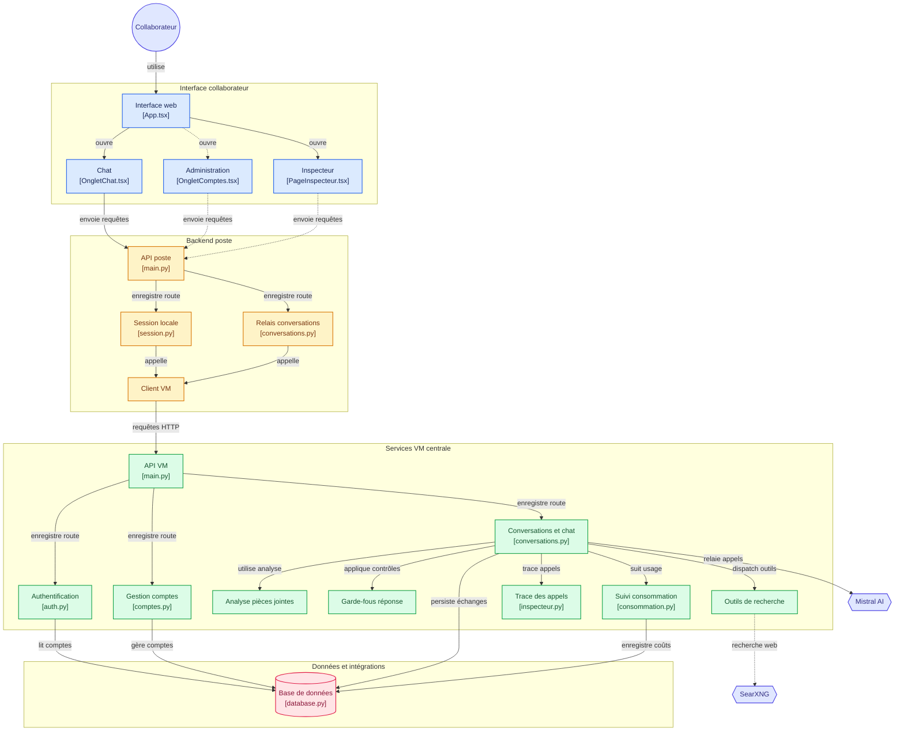

# Vue système (code)

Carte des paquets et flux principaux : interface collaborateur → backend poste → VM centrale → Postgres, Mistral et SearXNG. Le README garde un schéma court en tête, puis **recopie automatiquement** le Mermaid ci-dessous (`npm run sync-architecture-readme` / workflow Deploy docs).

Décisions associées : [ADR-0001](../adr/0001-backend-local-par-poste.md) (backend local par poste), [ADR-0002](../adr/0002-relais-central-mistral.md) (relais Mistral), [ADR-0008](../adr/0008-postgresql-vm-centrale.md) (PostgreSQL), [ADR-0013](../adr/0013-recherche-web-searxng-auto-heberge.md) (SearXNG).

Schéma généré initialement via [gitdiagram.com](https://gitdiagram.com/ulyssoulv/bbass-agents-ia). **Source de vérité** pour le diagramme détaillé du README : ce fichier. Mettre à jour ici (ou coller un nouveau export GitDiagram) quand l’arborescence change.

